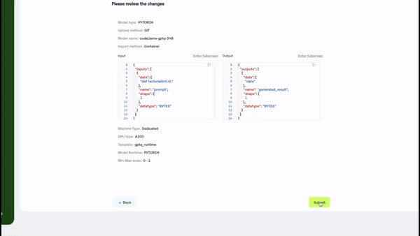

# Deploy a CodeLlama-Python-34B Model using Inferless

## Experimentation with different libraries

We have considered using 4 different inference libraries and tested the CodeLlama-34b-Python model with a max\_token of 512, with the default configuration of all the inference libraries.&#x20;

1. [Hugging Face](https://github.com/huggingface/transformers):  Transformer provides an easy-to-use pipeline for quick deployment of LLM but is not a good choice for LLM inference. We have used BitsandBytes with 4bit quantization, however it didn't help in improving the inference latency.
2. [AutoGPTQ](https://github.com/PanQiWei/AutoGPTQ): AutoGPTQ enables you to run LLM on low memory. We deploy a GPTQ 4bit quantized model and are able to achieve better inference latency and token/sec than Hugging Face(unquantized and [bitsandbytes](https://github.com/TimDettmers/bitsandbytes)).
3. [Text Generation Inference](https://github.com/huggingface/text-generation-inference) (TGI): TGI allows you to deploy and serve LLM. We have deployed and tested different type of quantized versions where 4bit quantized AWQ perform better.
4. [vLLM](https://github.com/vllm-project/vllm): vLLM is a library use for deployment and serving LLM. We have deployed both quantized and unquantized versions, both using vLLM and vLLM as a backend with the Triton inference server. We have used [vLLM-GPTQ](https://github.com/chu-tianxiang/vllm-gptq)(vLLM GPTQ brach) for deploying GPTQ quantized model, as of 24/11/23 vLLM doesn't support GPTQ quantization.


### Our  Observations

From our experiment, vLLM with GPTQ 4bit quantized model is a good setup for the lowest latency  `3.51 sec` and token generation of `58.40/sec`. This setup has an average cold start time  `30.42 sec` which includes an average loading time of `21.14 sec`.&#x20;

Note: _To use GPTQ with vLLM we have used the_ [_vLLM-GPTQ_](https://github.com/chu-tianxiang/vllm-gptq)_. To calculate the cold start time we have use only a single input for all the different combinations, cold start time includes initialization time + inference time._

### GPU Recommendation

We recommend the user use NVIDIA A100(80GB) GPU to achieve similar results.


<table data-full-width="true"><thead><tr><th>Library</th><th align="center">Quantization</th><th width="208">Avg Latency(sec)</th><th>Avg token/sec</th><th>Avg output token count</th><th align="center">Avg Cold Start time</th></tr></thead><tbody><tr><td>HuggingFace Transformer Pipeline</td><td align="center"> -</td><td>17.84</td><td>16.77</td><td>294.8</td><td align="center">-</td></tr><tr><td>HuggingFace Transformer</td><td align="center">nf4 4bit bitsandbytes</td><td>19.12</td><td>15.59</td><td>299.9</td><td align="center">-</td></tr><tr><td>AutoGPTQ</td><td align="center">GPTQ</td><td>9.73</td><td>32.14</td><td>285.4</td><td align="center">32.88(Load:12.11 ,Infer:20.76)</td></tr><tr><td>TGI</td><td align="center">AWQ</td><td>8.56</td><td>37.04</td><td>312.8</td><td align="center">-</td></tr><tr><td>TGI</td><td align="center">GPTQ</td><td>21.26</td><td>14.09</td><td>267.1</td><td align="center">-</td></tr><tr><td>TGI</td><td align="center">bitsandbytes</td><td>39.19</td><td>10.03</td><td>416.6</td><td align="center">-</td></tr><tr><td>vLLM</td><td align="center">-</td><td>14.07</td><td>21.46</td><td>301.5</td><td align="center">45.14(Load:21.14, Infer:23.99)</td></tr><tr><td>vLLM</td><td align="center">GPTQ</td><td>3.51</td><td>58.40</td><td>208.8</td><td align="center">30.42(Load:21.8,Infer:8.6)</td></tr><tr><td>vLLM</td><td align="center">AWQ</td><td>6.61</td><td>34.79</td><td>247.5</td><td align="center">36.84(Load:33.53,Infer:3.31)</td></tr><tr><td>Triton+vLLM(backend)</td><td align="center">-</td><td>15.61</td><td>24.25</td><td>341.9</td><td align="center">44.47(Load:19.86, Infer:24.60)</td></tr><tr><td>Triton+vLLM(backend)</td><td align="center">AWQ</td><td>7.36</td><td>41.43</td><td>276</td><td align="center">51.41(Load:36.55 ,Infer:14.85)</td></tr><tr><td>Triton+vLLM(backend)</td><td align="center">GPTQ</td><td>7.79</td><td>39.68</td><td>298.6</td><td align="center">29.08(Load:20.16, Infer: 8.91)</td></tr></tbody></table>

## Defining Dependencies

This tutorial utlizes `auto_gptq` to load and serve the model. It also uses the [`transformers`](https://github.com/huggingface/transformers) package for loading and using the tokenizer. These dependencies need to be added to the custom runtime .yaml file.

## Constructing the Github/Gitlab Template

While uploading your model from GitHub/Gitlab, you need to follow this format:

```html
codellama-34b-python/
├── app.py
└── config.yaml
```

* The [app.py](http://app.py) file will load and serve the model.
* The config.yaml file will have all the software and Python dependencies.
* You can also have any additional dependency files.

## Creating the class for inference

In the [app.py](http://app.py) file, first, you will import all the required classes and functions and then create a model class, for example, "InferlessPythonModel".This class will have three functions:

1.  `def initialize`: This function will load the model and tokenizer into the memory whenever the container starts.

    ```python
    def initialize(self):
            self.llm = LLM(
              model="TheBloke/CodeLlama-34B-Python-GPTQ",
              quantization="gptq")
    ```
2.  `def infer`: This function helps to serve the loaded model. You can create a complex inference pipeline or chain multiple models together here.

    ```python
    def infer(self, inputs):
            prompts = inputs["prompt"]
            sampling_params = SamplingParams(
                temperature=1.0,
                top_p=1,
                max_tokens=512
            )
            result = self.llm.generate(prompts, sampling_params)
            result_output = [output.outputs[0].text for output in result]

            return {"result": result_output[0]}
    ```
3.  `def finalize`: This function deallocates the allocated memory for the model and tokenizer whenever the container shuts down.

    <pre class="language-python"><code class="lang-python"><strong>def finalize(self,*args):
    </strong>    self.llm = None
    </code></pre>

## Creating the custom runtime

Whenever you upload the model through GitHub/GitLab, you must upload a custom runtime, i.e. a `config.yaml` file. This allows the user to add all the system and Python packages required for the model. For this tutorial, we are using the `libssl-dev` system package, and we use the Python packages mentioned in section 1.

```
build:
  cuda_version: "12.1.1"
  system_packages:
    - "libssl-dev"
  python_packages:
    - "accelerate"
    - "transformers"
    - "git+https://github.com/chu-tianxiang/vllm-gptq.git"
```

## Deploying the model on Inferless

Inferless supports multiple ways of [importing your model](https://docs.inferless.com/model-import/file-structure-requirements). For this tutorial, we will use GitHub.&#x20;

### Import the Model through GitHub

Click on the`Repo(Custom code)` and then click on the `Add provider` to connect to your GitHub account. Once your account integration is completed, click on your Github account and continue.

<figure><figcaption></figcaption></figure>

### Provide the Model details

Enter the name of the model and pass the GitHub repository URL.&#x20;

Now, you can define the model's input and output parameters in JSON format.  For more information, go through [this page](https://docs.inferless.com/model-import/input-output-json).

* INPUT: Refer to the function `def infer(self, inputs)`, here we mentioned  `inputs["prompt"]`, which means `inputs` the parameter will have a key `prompt.`
* OUTPUT: The same goes here, the function mentioned above will return the results as a key-value pair `return {"result": result}`.

Input JSON must include `prompt` a key to pass the instruction. For output JSON, it must be included`generated_result` to retrieve the output.

<figure><figcaption></figcaption></figure>

### GPU Selection

On the Inferless platform, we support all the GPUs. For this tutorial, we recommend using A100 GPU. Select A100 from the drop-down menu in the GPU Type.

<figure><figcaption></figcaption></figure>

### Using the Custom Runtime

In the `Advance configuration`, we have the option to select the custom runtime. First, click on the `Add runtime` to upload the `config.yaml` file, give any name and save it. Choose the runtime from the drop-down menu and then click on continue.

<figure><figcaption></figcaption></figure>

### Review and Deploy

In this final stage, carefully review all modifications. Once you've examined all changes, proceed to deploy the model by clicking the `Import` button.

Voilà, your model is now deployed!

<figure><figcaption></figcaption></figure>
